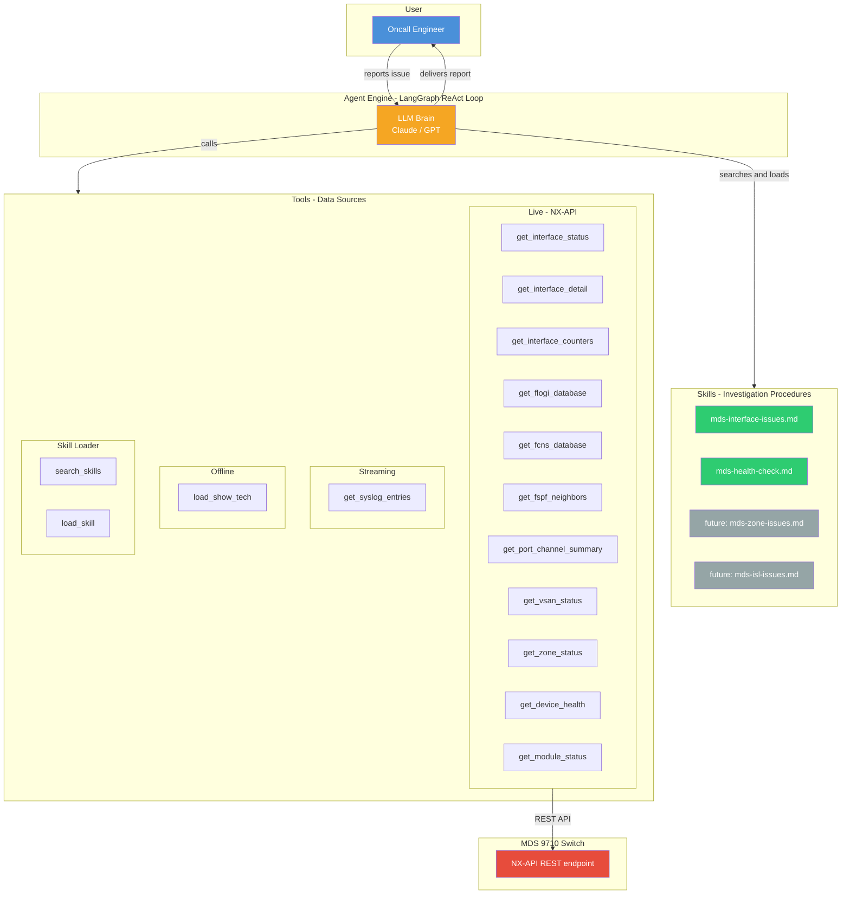
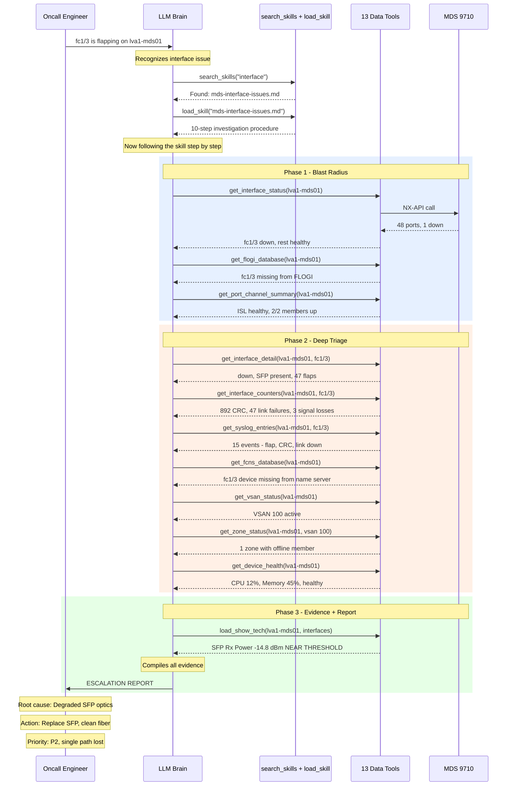
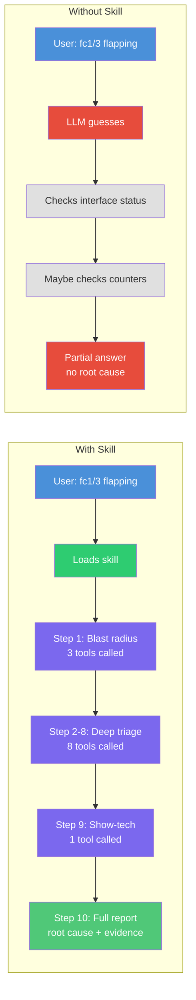
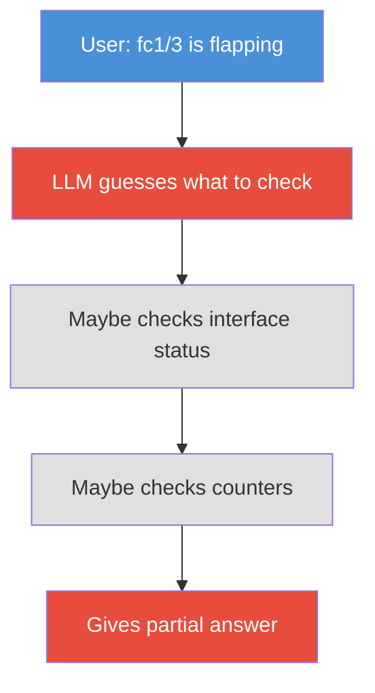

# How It Works — Agent Flow Explained

A simple guide to how the MDS Interface Triage Agent works, and why **skills** matter.

---

## 1. The Big Picture — All Components



> **15 tools**, **2 skills** (extensible), **1 LLM brain**, all orchestrated by the LangGraph ReAct loop. Skills tell the LLM *what to investigate*. Tools give it *live data*. The loop keeps going until the investigation is complete.

---

## 2. The Flow — "fc1/3 is flapping on lva1-mds01"

Here's exactly what happens when a user reports an interface issue:



**12 tool calls. 3 phases. 1 complete answer.** Every time, same investigation, same thoroughness.

---

## 3. With Skill vs Without Skill



| | With Skill | Without Skill |
|---|---|---|
| **Tools called** | 12 (all relevant) | 1-2 (random pick) |
| **Blast radius** | Always checked first | Skipped |
| **Root cause** | Identified with evidence | Guessed or missed |
| **SFP optics** | Checked via show-tech | Never looked |
| **FLOGI/Zone** | Verified fabric state | Skipped |
| **Report** | Structured escalation handoff | Partial text answer |
| **Consistency** | Same every time | Different every run |

---

## 3. Without Skill — LLM Wings It



**What happens:**
- LLM has tools but **no procedure to follow**
- Picks 1-2 tools based on its training — random, not systematic
- **Skips:** FLOGI check, ISL impact, zone status, SFP optics, syslog correlation
- Gives a surface-level answer — misses root cause

**Result:** Incomplete, inconsistent. Different every time. Misses critical evidence.

---

## Side-by-Side Comparison

| | With Skill | Without Skill |
|---|---|---|
| **Tools called** | 10+ (all relevant) | 1-2 (random pick) |
| **Blast radius** | Always checked first | Skipped |
| **Root cause** | Identified with evidence | Guessed or missed |
| **Report** | Structured escalation handoff | Partial text answer |
| **Consistency** | Same every time | Different every run |
| **Oncall trust** | High — follows the procedure | Low — depends on luck |

---

## Key Concept

```
Skill = The investigation procedure (what to check, in what order)
Tool  = The data source (gets live data from the switch)
LLM   = The brain (reasons about results, follows the skill)

Skill tells the LLM WHAT to do.
Tools give the LLM DATA to work with.
Without a skill, the LLM has data but no plan.
```

---

*This agent is built for MDS 9710 interface issues. The same pattern works for any domain — write a skill, wire up tools, let the LLM follow the procedure.*
