# How the Storage Oncall Agent Works — A Visual Story

---

## Chapter 1: The Big Picture

> You type a question. Claude thinks. Your tools fetch data. Claude thinks again. You get an answer.

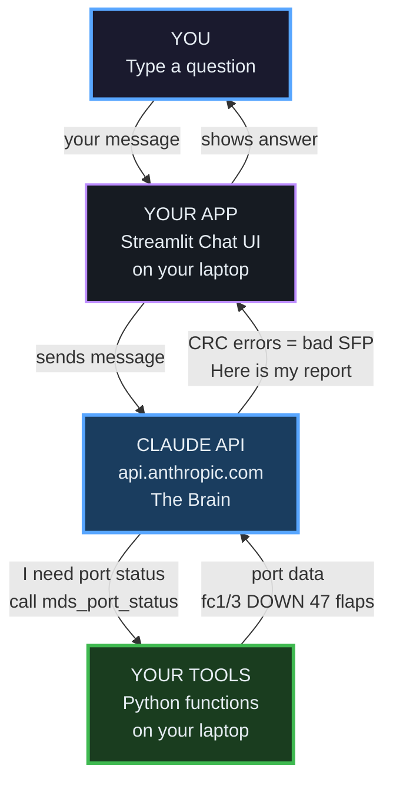

**Three things. That's it.**
- **Claude** = the brain (thinks, decides which tool to call)
- **Tools** = the hands (fetch data from your infrastructure)
- **App** = the glue (passes messages back and forth)

---

## Chapter 2: The Two Things That Happen

> Only two things ever happen. They take turns. That's the whole system.

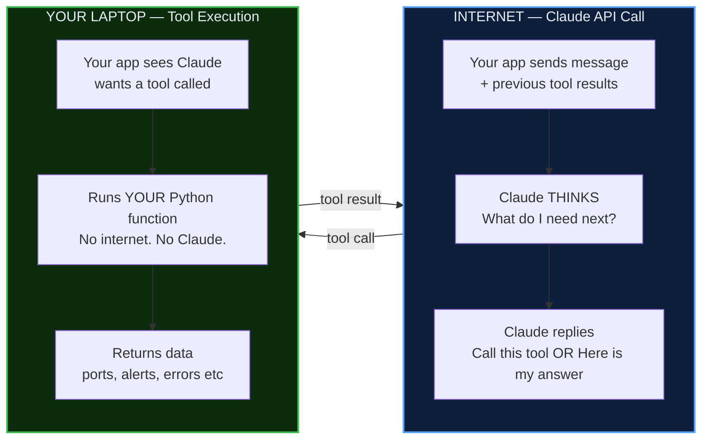

**Rule 1:** Claude = brain. Runs on Anthropic's servers. Requires internet.

**Rule 2:** Tool = hands. Runs on YOUR machine. No internet needed.

**They alternate. That's it.**

---

## Chapter 3: The ReAct Loop — What Actually Happens Per Request

> Claude calls tools in a loop until it has enough info to answer.

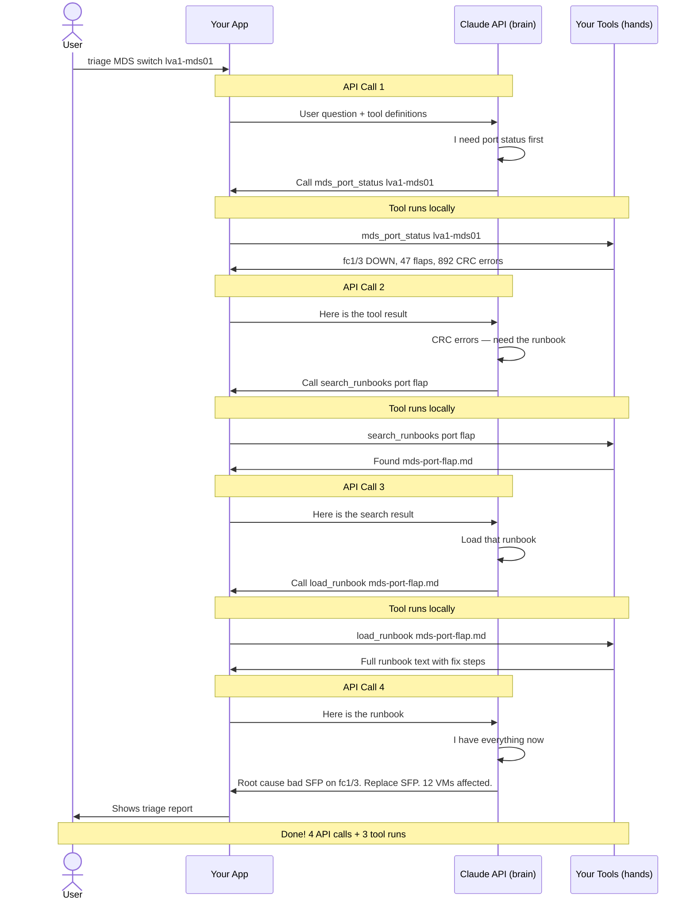

---

## Chapter 4: Tool vs Skill — When to Use Which

> **Tool** = gets data (what's happening?). **Skill** = investigation procedure (what should I do about it?)

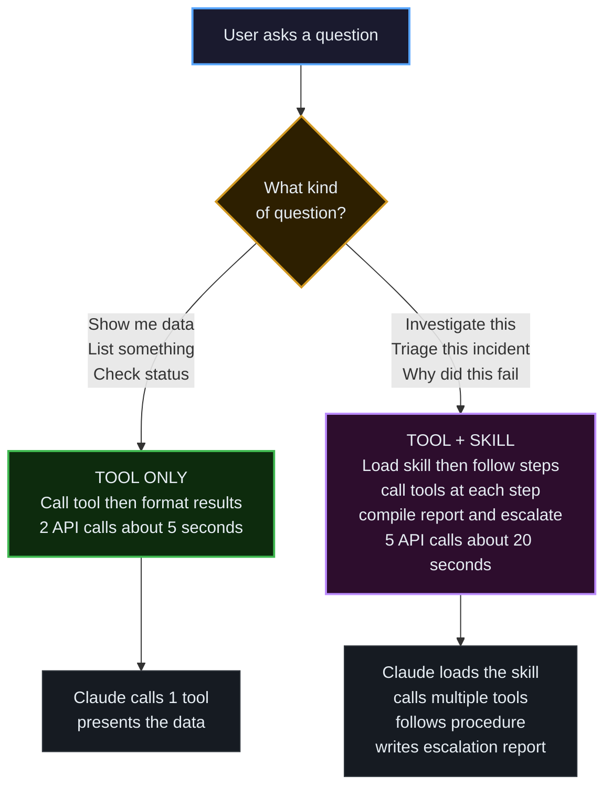

---

## Chapter 5: Example 1 — "Show me failed backups" (Data Query)

> Simple. One tool. No skill needed.

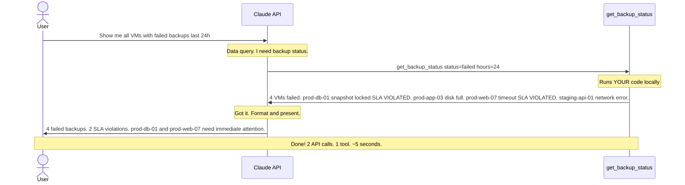

---

## Chapter 6: Example 2 — "Investigate and escalate" (Skill-Driven)

> Complex. Skill guides the investigation. Multiple tools gather evidence. Human gets the report.

```mermaid
sequenceDiagram
    actor User
    participant Claude as Claude API
    participant Tools as Your Tools
    participant Skill as backup-failure.md

    User->>Claude: Backup failed on prod-db-01 investigate and escalate

    rect rgb(20, 40, 20)
    Note over Claude,Tools: Step 1 - Get failure data
    Claude->>Tools: get_backup_status vm=prod-db-01
    Tools->>Claude: snapshot_locked, SLA violated, 14-day-old snapshot
    end

    rect rgb(40, 20, 40)
    Note over Claude,Skill: Step 2 - Load investigation skill
    Claude->>Tools: search_runbooks backup failure
    Tools->>Claude: Found backup-failure.md
    Claude->>Tools: load_runbook backup-failure.md
    Tools->>Claude: Full investigation procedure
    end

    Note over Claude: Now FOLLOWS the skill step by step

    rect rgb(20, 40, 20)
    Note over Claude,Tools: Step 3 - Check storage (skill says to)
    Claude->>Tools: datastore_health ds-lva1-stor05
    Tools->>Claude: 5.4% free, write latency 45ms, 8 SCSI errors
    end

    rect rgb(20, 40, 20)
    Note over Claude,Tools: Step 4 - Check VM (skill says to)
    Claude->>Tools: esxi_vm_status prod-db-01
    Tools->>Claude: memory 92%, stale snapshot 80.5 GB
    end

    rect rgb(20, 40, 20)
    Note over Claude,Tools: Step 5 - Check array (skill says to)
    Claude->>Tools: array_health stor-lva1-array05
    Tools->>Claude: DEGRADED, 2 failed disks, rebuilding 43%
    end

    rect rgb(40, 30, 10)
    Note over Claude: Step 6 - Compile escalation report
    Claude->>User: ESCALATION REPORT. Root cause: 14-day locked snapshot + array rebuild. Blast radius: 47 VMs. Action: delete snapshot needs DB team approval. Escalate to database-infra. NO REMEDIATION ATTEMPTED.
    end

    Note over User,Skill: Done! 5 API calls. 6 tools. ~20 seconds.
```

---

## Chapter 7: What You Control vs What Claude Controls

```mermaid
flowchart LR
    subgraph YOU["YOU CONTROL"]
        direction TB
        Y1[Which tools exist\nPython functions]
        Y2[What each tool does\nCode inside the function]
        Y3[Which skills exist\nMarkdown files]
        Y4[What steps in each skill\nInvestigation procedure]
        Y5[System prompt\nAgent personality and rules]
    end

    subgraph CLAUDE["CLAUDE CONTROLS"]
        direction TB
        C1[Which tool to call\nPicks from your list]
        C2[What parameters to pass\nBased on user question]
        C3[What to do with results\nReasoning over data]
        C4[When to stop\nWhen it has enough info]
        C5[How to format the answer\nBased on your system prompt]
    end

    YOU ~~~ CLAUDE

    style YOU fill:#0d2b0d,stroke:#3fb950,stroke-width:2px,color:#e6edf3
    style CLAUDE fill:#0d1f3c,stroke:#58a6ff,stroke-width:2px,color:#e6edf3
```

---

## Chapter 8: The File Map

> 12 files. That's the whole project.

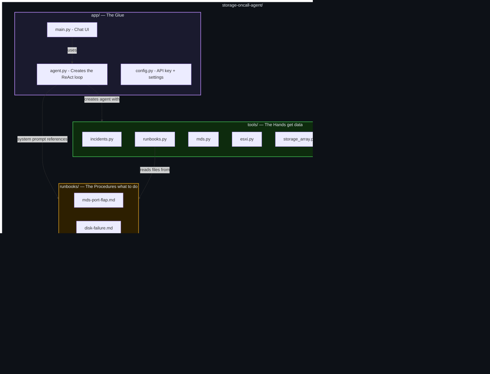

---

## Chapter 9: From POC to Production

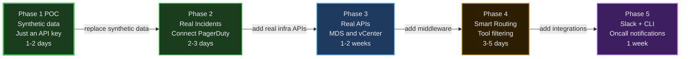

---

## Chapter 10: Real World — All Data Sources Working Together

> Your friend has live data (RV tool, syslog) AND offline data (show-tech files). Both are tools. Skills tell Claude when to use which.

### The Rule

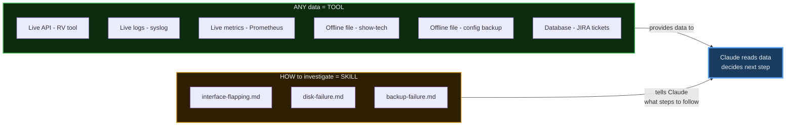

Doesn't matter if data comes from a live API or a file on disk. Tool = data. Skill = steps.

---

### The Tools — All Data Sources

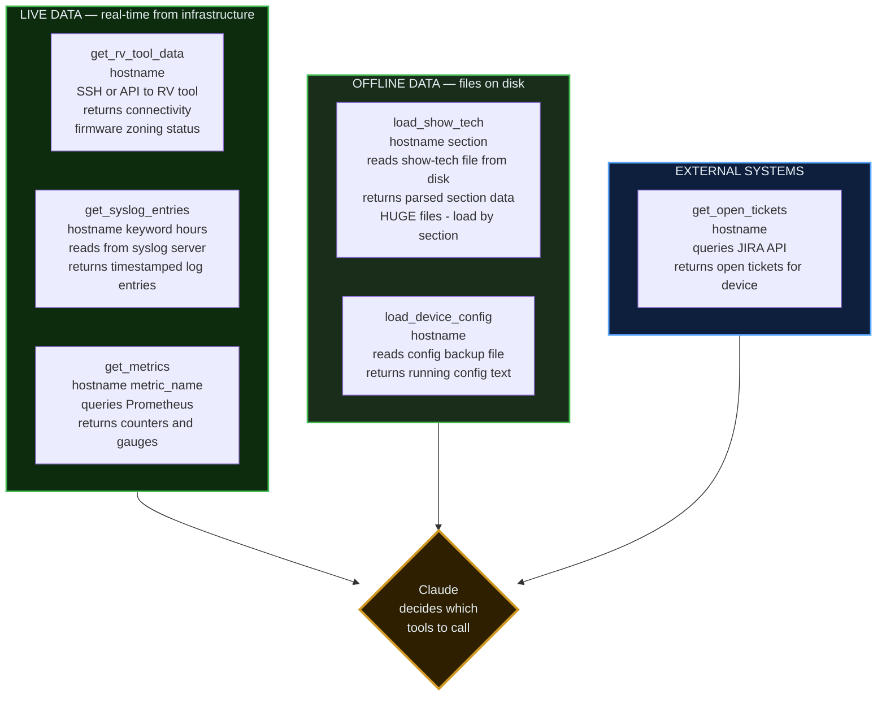

---

### Show-Tech — Why Two-Step Loading

> Show-tech files are 10,000+ lines. If you dump everything into Claude, it chokes. So load in two steps.

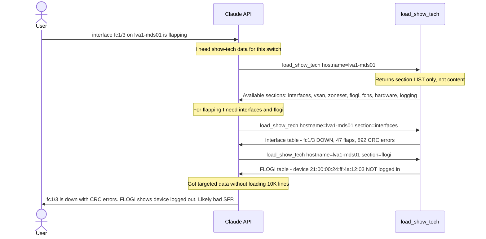

---

### Full Investigation — Live + Offline + Skill Together

> User says: "interface fc1/3 on lva1-mds01 is flapping, investigate"

> Claude loads the skill, then calls live tools AND offline tools as the skill directs.

```mermaid
sequenceDiagram
    actor User
    participant Claude as Claude API
    participant Live as Live Tools
    participant Offline as Offline Tools
    participant Skill as interface-flapping.md

    User->>Claude: interface fc1/3 on lva1-mds01 is flapping, investigate

    Note over Claude: Need failure data + investigation skill

    rect rgb(40, 20, 40)
    Note over Claude,Skill: Load the investigation skill
    Claude->>Live: search_runbooks interface flapping
    Live->>Claude: Found interface-flapping.md
    Claude->>Live: load_runbook interface-flapping.md
    Live->>Claude: Full skill with steps
    end

    Note over Claude: Skill Step 1 says check syslog

    rect rgb(20, 40, 20)
    Note over Claude,Live: Step 1 - Live syslog data
    Claude->>Live: get_syslog_entries lva1-mds01 flap 24
    Live->>Claude: 47 flap events, last one 10 min ago
    Claude->>Live: get_syslog_entries lva1-mds01 CRC 24
    Live->>Claude: 892 CRC errors on fc1/3
    end

    Note over Claude: Skill Step 2 says check RV tool

    rect rgb(20, 40, 20)
    Note over Claude,Live: Step 2 - Live RV tool data
    Claude->>Live: get_rv_tool_data lva1-mds01
    Live->>Claude: connectivity 1 path down, firmware current
    end

    Note over Claude: Skill Step 3 says check show-tech

    rect rgb(20, 30, 40)
    Note over Claude,Offline: Step 3 - Offline show-tech data
    Claude->>Offline: load_show_tech lva1-mds01
    Offline->>Claude: Available sections: interfaces, flogi, hardware...
    Claude->>Offline: load_show_tech lva1-mds01 section=interfaces
    Offline->>Claude: fc1/3 error counters confirm CRC trend
    Claude->>Offline: load_show_tech lva1-mds01 section=flogi
    Offline->>Claude: Device 21:00:00:24:ff:4a:12:03 NOT logged in
    end

    Note over Claude: Skill Step 4 says correlate

    rect rgb(40, 30, 10)
    Note over Claude: Step 4 - Correlate and compile report
    Claude->>Claude: CRC errors in syslog + show-tech confirm bad SFP
    Claude->>Claude: FLOGI shows device logged out
    Claude->>Claude: RV tool shows 1 path down
    Claude->>User: ESCALATION REPORT\nRoot cause: bad SFP on fc1/3\nEvidence: 892 CRC errors in syslog, confirmed in show-tech,\nFLOGI shows device logged out, RV tool shows path down\nBlast radius: stor-lva1-array05 lost 1 path\nAction: replace SFP on fc1/3\nEscalate to: storage-infra for SFP swap
    end

    Note over User,Offline: 6 API calls. 7 tools used. Live + offline data correlated.
```

---

### The Skill That Drove This Investigation

This is what `interface-flapping.md` looks like — it names exact tools and exact parameters:

```
# Skill: Interface Flapping Investigation

Step 1: Check syslog (LIVE)
  - get_syslog_entries(hostname, "flap", 24) → count flap events
  - get_syslog_entries(hostname, "CRC", 24) → CRC errors present?

Step 2: Check RV tool (LIVE)
  - get_rv_tool_data(hostname) → connectivity and firmware

Step 3: Check show-tech (OFFLINE)
  - load_show_tech(hostname) → list available sections
  - load_show_tech(hostname, "interfaces") → error counters
  - load_show_tech(hostname, "flogi") → device login status

Step 4: Correlate and report
  - CRC in syslog + CRC in show-tech → physical layer issue (bad SFP/cable)
  - No CRC anywhere → host HBA issue or firmware bug
  - FLOGI device not logged in → confirms link is fully down
  - Compile escalation report. DO NOT remediate.
```

Claude follows this like a checklist. The more specific the tool names and parameters, the better Claude follows them.

---

### Summary — All Data Sources

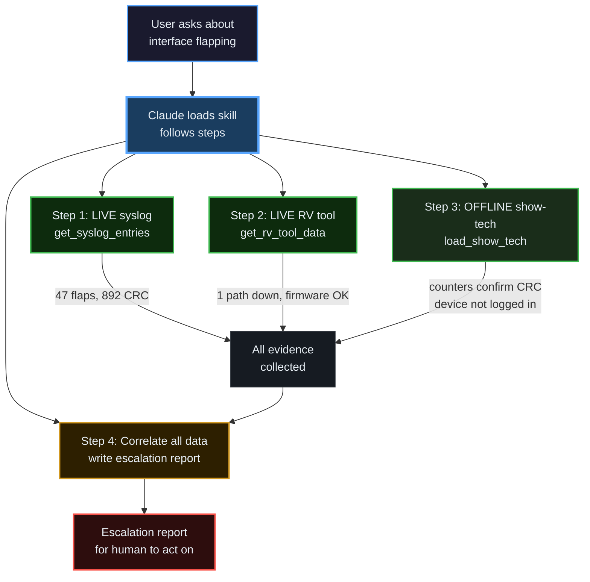

**Live data + offline data + skills = full investigation. Claude correlates everything. Human gets the report.**

---

---

## Chapter 11: MDS 9710 Interface Triage — The Full Skill in Action

> This is the real use case. An MDS switch interface goes down. The skill drives a 10-step investigation. Claude follows it step by step, calling tools, collecting evidence, and handing off to a human.

### The Scenario

```
ALERT: InterfaceFlapping — lva1-mds01 fc1/3 — 47 flaps in 24h, 892 CRC errors
```

### How the Skill Drives the Agent

```mermaid
sequenceDiagram
    actor Oncall as Storage Oncall
    participant Agent as Claude Agent
    participant Skill as mds-interface-issues.md
    participant Tools as Python Tools
    participant ShowTech as Show-Tech Files

    Oncall->>Agent: triage lva1-mds01 fc1/3 flapping

    Note over Agent: Load the skill first
    Agent->>Skill: load_skill(mds-interface-issues.md)
    Skill-->>Agent: 10-step investigation procedure

    rect rgb(13, 43, 13)
        Note over Agent,Tools: PHASE 1 - BLAST RADIUS
        Agent->>Tools: get_interface_status(lva1-mds01)
        Tools-->>Agent: fc1/3 is F-port, connected to storage array, VSAN 100
        Note over Agent: F-port to storage = single path affected

        Agent->>Tools: get_flogi_database(lva1-mds01)
        Tools-->>Agent: WWPN 21:00:00:24:ff:4a:12:03 - NOT logged in
        Note over Agent: Device lost from fabric
    end

    rect rgb(26, 26, 46)
        Note over Agent,ShowTech: PHASE 2 - TRIAGE
        Agent->>Tools: get_interface_status(lva1-mds01, fc1/3)
        Tools-->>Agent: Status: down, reason: link_failure

        Agent->>Tools: get_interface_counters(lva1-mds01, fc1/3)
        Tools-->>Agent: 47 link failures, 892 CRC, 3 signal losses

        Agent->>Tools: get_syslog_entries(lva1-mds01, fc1/3, 1)
        Tools-->>Agent: 47 flap events in last hour

        Note over Agent: CRC + signal loss = physical layer issue

        Agent->>Tools: get_flogi_database(lva1-mds01)
        Tools-->>Agent: fc1/3 FLOGI missing

        Agent->>Tools: get_vsan_status(lva1-mds01)
        Tools-->>Agent: VSAN 100 active, zone member missing

        Agent->>Tools: get_device_health(lva1-mds01)
        Tools-->>Agent: CPU 35%, memory 62%, modules OK
    end

    rect rgb(45, 31, 0)
        Note over Agent,ShowTech: PHASE 3 - FILL GAPS WITH OFFLINE DATA
        Agent->>ShowTech: load_show_tech(lva1-mds01)
        ShowTech-->>Agent: Sections: interfaces, flogi, vsan, hardware, logging

        Agent->>ShowTech: load_show_tech(lva1-mds01, interfaces)
        ShowTech-->>Agent: fc1/3 counter detail confirms CRC trend
    end

    rect rgb(45, 13, 13)
        Note over Agent: PHASE 4 - ESCALATE
        Note over Agent: Evidence compiled from 10 steps
        Agent-->>Oncall: HANDOFF REPORT
    end
```

### The Escalation Report Claude Produces

```
HANDOFF:
  device:         lva1-mds01
  platform:       Cisco MDS 9710
  alert:          InterfaceFlapping + CRCErrors
  port:           fc1/3
  port_type:      F-port (storage array)
  connected_to:   WWPN 21:00:00:24:ff:4a:12:03 (stor-lva1-array05-hba3)
  vsan:           100
  root_cause:     PHYSICAL — bad SFP or fiber cable
  blast_radius:   Single storage path — check multipath on connected hosts

  evidence:
    interface_state:    down (link_failure)
    link_failures_1hr:  47
    crc_errors:         892
    signal_losses:      3
    flogi_status:       missing (device not in fabric)
    vsan_state:         active
    zone_intact:        no — member missing from z_array05_host12
    device_health:      OK (CPU 35%, mem 62%, modules OK)
    show_tech_used:     yes — confirmed CRC trend in counter history

  recommended:    Replace SFP and fiber on fc1/3. Clean connectors.
                  After replacement, verify FLOGI re-registers.
  notify:         DC Technicians
```

### The Investigation Flow — All 10 Steps

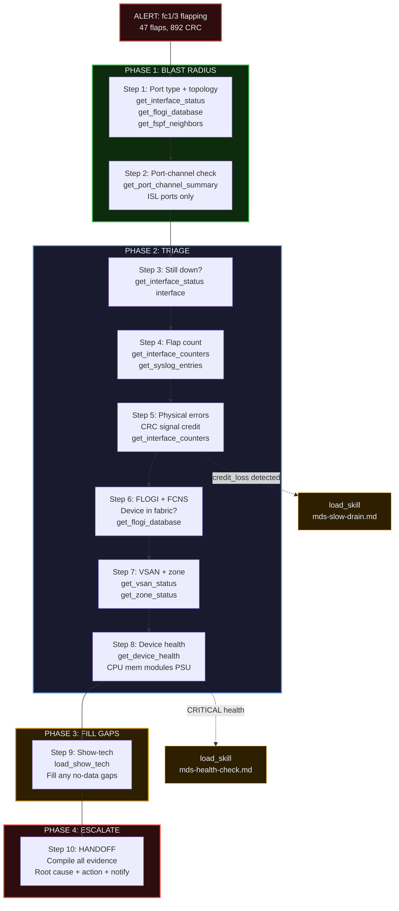

### Decision Logic at Each Step

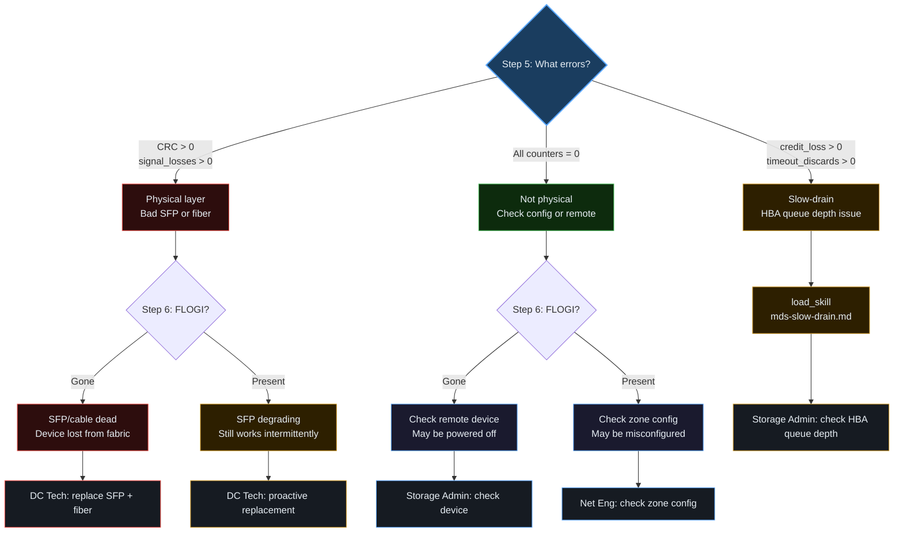

### What the Agent DOES vs DOES NOT Do

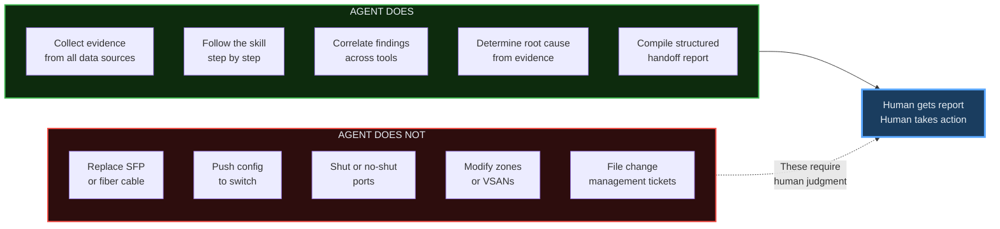

### File Structure — Skills + Tools

```
storage-oncall-agent/
├── skills/                              # Investigation procedures
│   ├── mds-interface-issues.md          # THIS skill — 10-step interface triage
│   ├── mds-health-check.md              # Device health assessment
│   ├── mds-slow-drain.md                # Credit loss investigation
│   ├── mds-zone-issues.md               # Zone database troubleshooting
│   ├── storage-array-connectivity.md    # Array port + multipath check
│   └── esxi-hba-issues.md              # Host HBA troubleshooting
│
├── tools/                               # Data sources (Python functions)
│   ├── mds.py                           # get_interface_status, get_interface_counters
│   │                                    # get_flogi_database, get_fspf_neighbors
│   │                                    # get_port_channel_summary, get_vsan_status
│   │                                    # get_zone_status, get_device_health
│   ├── syslog.py                        # get_syslog_entries
│   ├── show_tech.py                     # load_show_tech (two-step: list then load)
│   ├── esxi.py                          # esxi_vm_status, datastore_health
│   ├── storage_array.py                 # array_health, disk_failures
│   ├── rv_tool.py                       # rv_tool_check
│   └── skills.py                        # search_skills, load_skill
│
└── app/
    ├── agent.py                         # LangGraph ReAct loop
    └── main.py                          # Streamlit UI
```

---

## The One-Sentence Summary

> **You define the tools (data from anywhere — APIs, syslog, files on disk) and skills (step-by-step procedures). Claude decides when to call them and synthesizes everything into a human-readable answer.**

That's it. That's the whole thing.
