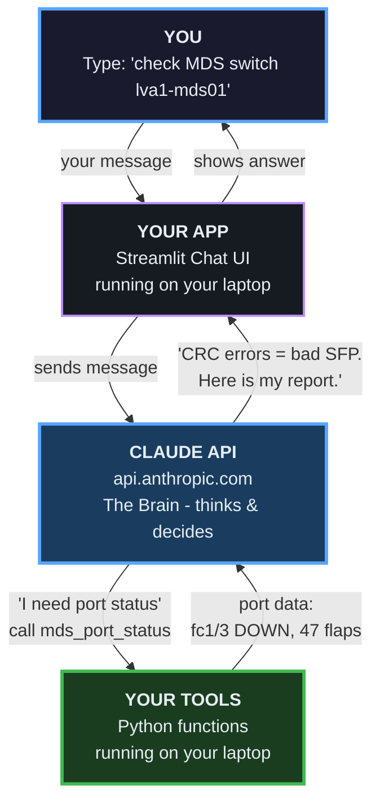
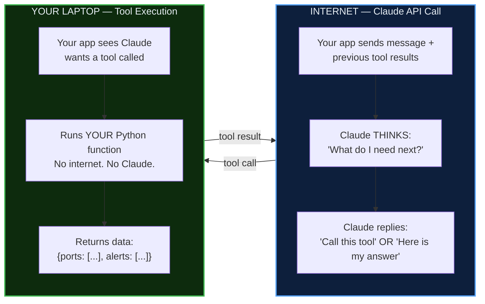
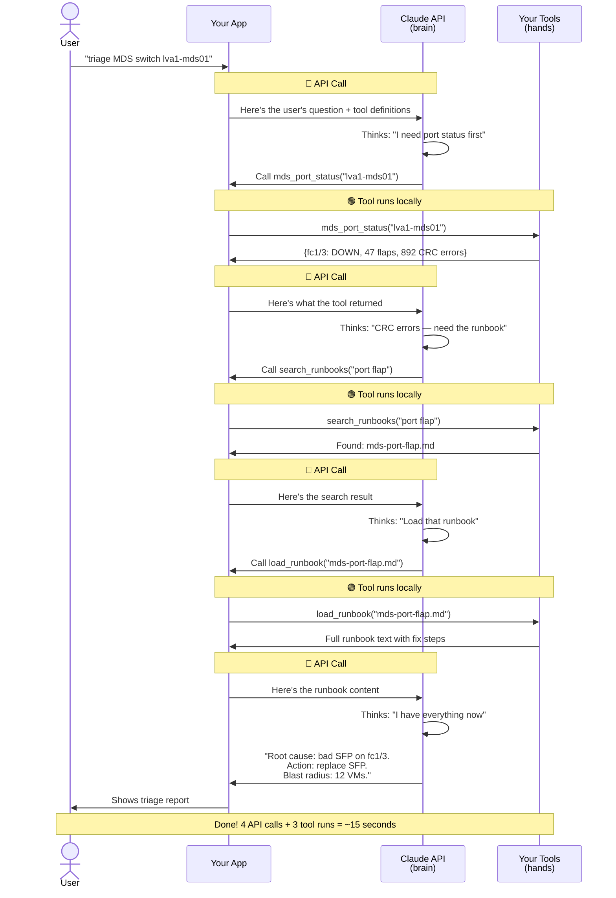
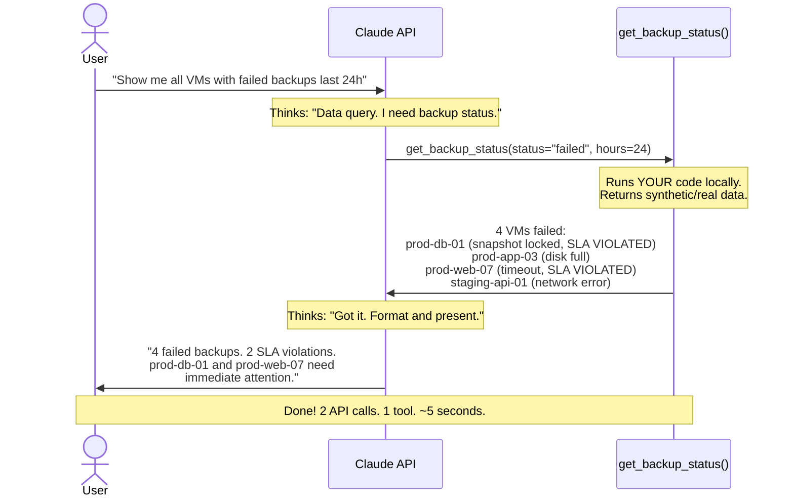
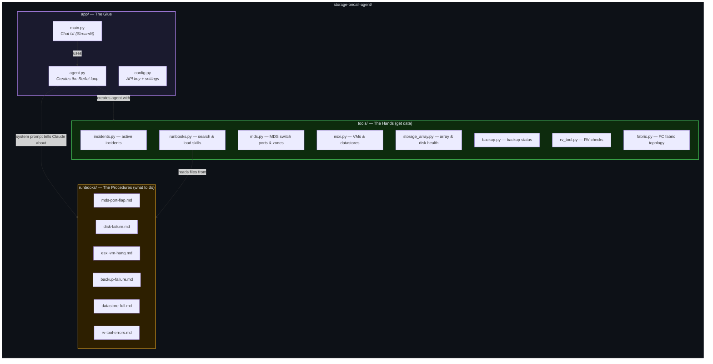

# How the Storage Oncall Agent Works — A Visual Story

---

## Chapter 1: The Big Picture

> You type a question. Claude thinks. Your tools fetch data. Claude thinks again. You get an answer.



**Three things. That's it.**
- **Claude** = the brain (thinks, decides which tool to call)
- **Tools** = the hands (fetch data from your infrastructure)
- **App** = the glue (passes messages back and forth)

---

## Chapter 2: The Two Things That Happen

> Only two things ever happen. They take turns. That's the whole system.



**Rule 1:** Claude = brain. Runs on Anthropic's servers. Requires internet.

**Rule 2:** Tool = hands. Runs on YOUR machine. No internet needed.

**They alternate. That's it.**

---

## Chapter 3: The ReAct Loop — What Actually Happens Per Request

> Claude calls tools in a loop until it has enough info to answer.



---

## Chapter 4: Tool vs Skill — When to Use Which

> **Tool** = gets data (what's happening?). **Skill** = investigation procedure (what should I do about it?)

```mermaid
flowchart TD
    Q["User asks a question"]
    
    Q --> D{"What kind<br/>of question?"}
    
    D -->|"Show me data"<br/>"List failed backups"<br/>"Check port status"| TOOL_ONLY["<b>Tool Only</b><br/>Call tool → format results → done<br/><i>2 API calls, ~5 seconds</i>"]
    
    D -->|"Investigate this"<br/>"Triage this incident"<br/>"Why did this fail?"| BOTH["<b>Tool + Skill</b><br/>Load skill → follow steps →<br/>call tools at each step →<br/>compile report → escalate<br/><i>5 API calls, ~20 seconds</i>"]
    
    TOOL_ONLY --> R1["Claude calls <b>1 tool</b>,<br/>presents the data"]
    
    BOTH --> R2["Claude loads the <b>skill</b>,<br/>calls <b>multiple tools</b>,<br/>follows procedure,<br/>writes escalation report"]

    style Q fill:#1a1a2e,stroke:#58a6ff,stroke-width:2px,color:#e6edf3
    style D fill:#2d1f00,stroke:#d29922,stroke-width:2px,color:#e6edf3
    style TOOL_ONLY fill:#0d2b0d,stroke:#3fb950,stroke-width:2px,color:#e6edf3
    style BOTH fill:#2d0d2d,stroke:#bc8cff,stroke-width:2px,color:#e6edf3
    style R1 fill:#161b22,stroke:#30363d,color:#e6edf3
    style R2 fill:#161b22,stroke:#30363d,color:#e6edf3
```

---

## Chapter 5: Example 1 — "Show me failed backups" (Data Query)

> Simple. One tool. No skill needed.



---

## Chapter 6: Example 2 — "Investigate and escalate" (Skill-Driven)

> Complex. Skill guides the investigation. Multiple tools gather evidence. Human gets the report.

```mermaid
sequenceDiagram
    actor User
    participant Claude as Claude API
    participant Tools as Your Tools
    participant Skill as backup-failure.md

    User->>Claude: "Backup failed on prod-db-01, investigate and escalate"
    
    rect rgb(20, 40, 20)
    Note over Claude,Tools: Step 1: Get failure data
    Claude->>Tools: get_backup_status(vm="prod-db-01")
    Tools->>Claude: snapshot_locked, SLA violated, 14-day-old snapshot
    end

    rect rgb(40, 20, 40)
    Note over Claude,Skill: Step 2: Load investigation skill
    Claude->>Tools: search_runbooks("backup failure")
    Tools->>Claude: Found: backup-failure.md
    Claude->>Tools: load_runbook("backup-failure.md")
    Tools->>Claude: Full investigation procedure
    end

    Note over Claude: Now FOLLOWS the skill step by step

    rect rgb(20, 40, 20)
    Note over Claude,Tools: Step 3: Check storage (skill says to)
    Claude->>Tools: datastore_health("ds-lva1-stor05")
    Tools->>Claude: 5.4% free, write latency 45ms, 8 SCSI errors
    end

    rect rgb(20, 40, 20)
    Note over Claude,Tools: Step 4: Check VM (skill says to)
    Claude->>Tools: esxi_vm_status("prod-db-01")
    Tools->>Claude: memory 92%, stale snapshot 80.5 GB
    end

    rect rgb(20, 40, 20)
    Note over Claude,Tools: Step 5: Check array (skill says to)
    Claude->>Tools: array_health("stor-lva1-array05")
    Tools->>Claude: DEGRADED, 2 failed disks, rebuilding 43%
    end

    rect rgb(40, 30, 10)
    Note over Claude: Step 6: Compile escalation report (skill template)
    Claude->>User: ESCALATION REPORT:<br/>Root cause: 14-day locked snapshot<br/>+ array rebuild causing latency<br/>Blast radius: 47 VMs<br/>Action: delete snapshot (need DB team approval)<br/>Escalate to: database-infra (SLA violated)<br/><br/>⚠️ NO REMEDIATION ATTEMPTED
    end

    Note over User,Skill: Done! 5 API calls. 6 tools. ~20 seconds.<br/>Human decides what to fix.
```



---

## Chapter 7: What You Control vs What Claude Controls

```mermaid
flowchart LR
    subgraph YOU["  🔧 YOU CONTROL  "]
        direction TB
        Y1["Which tools exist<br/><i>Python functions with @tool</i>"]
        Y2["What each tool does<br/><i>Code inside the function</i>"]
        Y3["Which skills exist<br/><i>Markdown files in runbooks/</i>"]
        Y4["What steps are in each skill<br/><i>Investigation procedure</i>"]
        Y5["System prompt<br/><i>Agent's personality & rules</i>"]
    end

    subgraph CLAUDE["  🧠 CLAUDE CONTROLS  "]
        direction TB
        C1["Which tool to call<br/><i>Picks from your list</i>"]
        C2["What parameters to pass<br/><i>Based on user's question</i>"]
        C3["What to do with results<br/><i>Reasoning over data</i>"]
        C4["When to stop<br/><i>When it has enough info</i>"]
        C5["How to format the answer<br/><i>Based on your system prompt</i>"]
    end

    YOU ~~~ CLAUDE

    style YOU fill:#0d2b0d,stroke:#3fb950,stroke-width:2px,color:#e6edf3
    style CLAUDE fill:#0d1f3c,stroke:#58a6ff,stroke-width:2px,color:#e6edf3
```



---

## Chapter 8: The File Map

> 12 files. That's the whole project.



---

## Chapter 9: From POC to Production

```mermaid
flowchart LR
    P1["<b>Phase 1: POC</b><br/>Synthetic data<br/>Just an API key<br/><i>1-2 days</i>"]
    P2["<b>Phase 2: Real Incidents</b><br/>Connect PagerDuty/<br/>OpsGenie<br/><i>2-3 days</i>"]
    P3["<b>Phase 3: Real APIs</b><br/>MDS NX-API<br/>vCenter REST<br/><i>1-2 weeks</i>"]
    P4["<b>Phase 4: Smart Routing</b><br/>Tool filtering<br/>Model switching<br/><i>3-5 days</i>"]
    P5["<b>Phase 5: Slack + CLI</b><br/>Oncall notifications<br/>Terminal triage<br/><i>1 week</i>"]

    P1 -->|"replace synthetic data"| P2
    P2 -->|"add real infra APIs"| P3
    P3 -->|"add middleware"| P4
    P4 -->|"add integrations"| P5

    style P1 fill:#1a3d1f,stroke:#3fb950,stroke-width:3px,color:#e6edf3
    style P2 fill:#1a3d1f,stroke:#3fb950,stroke-width:2px,color:#e6edf3
    style P3 fill:#1f3a5f,stroke:#58a6ff,stroke-width:2px,color:#e6edf3
    style P4 fill:#2d1f00,stroke:#d29922,stroke-width:2px,color:#e6edf3
    style P5 fill:#3d1f5f,stroke:#bc8cff,stroke-width:2px,color:#e6edf3
```



---

## The One-Sentence Summary

> **You define the tools (data) and skills (procedures). Claude decides when to call them and synthesizes everything into a human-readable answer.**

That's it. That's the whole thing.
